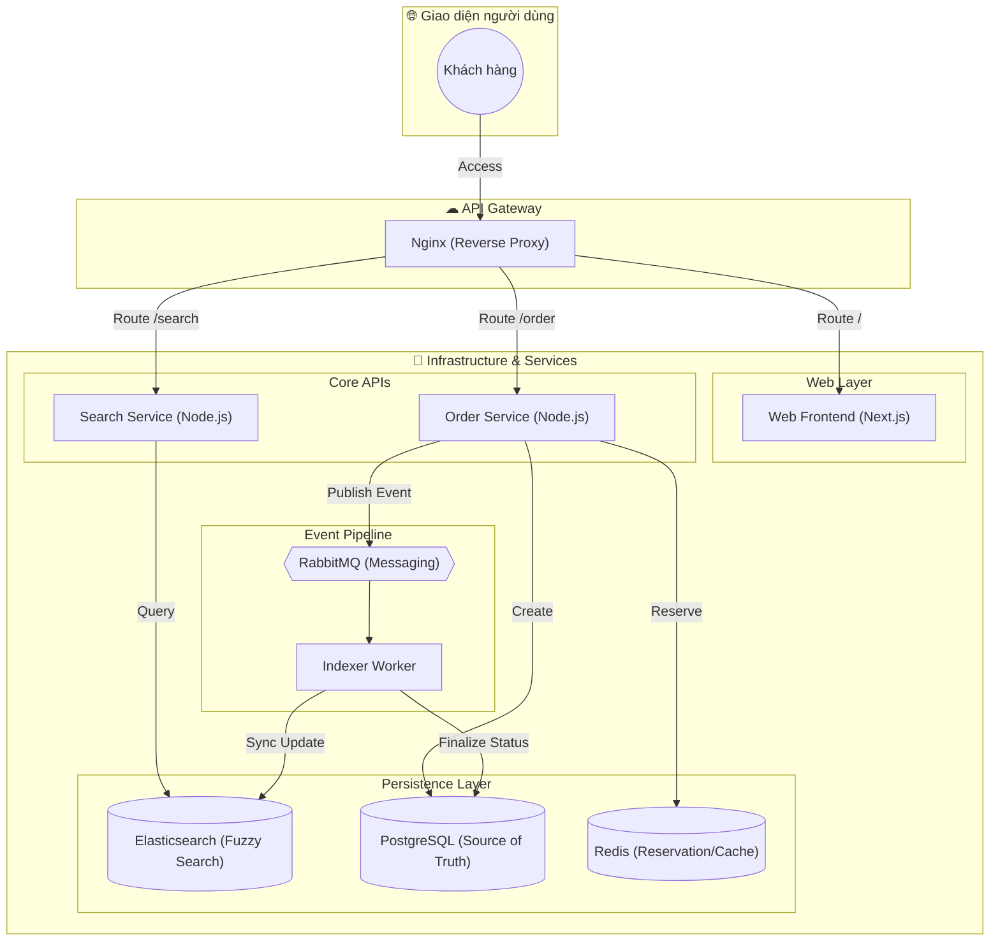

# 🚀 Search Engine POC - Hệ thống Tìm kiếm Thương mại Điện tử Quy mô lớn

Dự án này là một bản thử nghiệm (Proof of Concept) xây dựng hệ thống tìm kiếm sản phẩm hiện đại, có khả năng mở rộng cao, sử dụng kiến trúc **Microservices** và luồng dữ liệu **Event-driven**. Mục tiêu cốt lõi là đạt tốc độ tìm kiếm cực nhanh (< 100ms) và đảm bảo tính nhất quán dữ liệu giữa CSDL gốc và Search Engine.

---

## 🏗️ 1. Kiến trúc Hệ thống (System Architecture)

Hệ thống được thiết kế theo mô hình Microservices, tách biệt hoàn toàn giữa luồng Đọc (Search) và luồng Ghi (Order/Sync).



---

## 🛠️ 2. Thành phần chi tiết (Service Breakdown)

### 🏪 **Web Frontend (Next.js)**
- **Công nghệ:** Next.js 14, Tailwind CSS.
- **Vai trò:** Cung cấp giao diện mua sắm mượt mà, hỗ trợ Server-Side Rendering (SSR) để tối ưu SEO.

### 🔍 **Search Service (Node.js)**
- **Công nghệ:** Express, Elasticsearch Client.
- **Nhiệm vụ:** Tiếp nhận truy vấn từ người dùng, thực hiện tìm kiếm toàn văn (Full-text search) và tìm kiếm mờ (Fuzzy search) trên Elasticsearch.
- **Tốc độ:** Phản hồi < 50ms cho hàng triệu bản ghi.

### 🛒 **Order Service (Node.js)**
- **Công nghệ:** Express, Redis, PostgreSQL.
- **Nhiệm vụ:** 
  - Xử lý nghiệp vụ đặt hàng.
  - Sử dụng **Redis Atomic Increment/Decrement** để giữ chỗ (Reservation) tồn kho cực nhanh, chống Overselling.
  - Ghi đơn hàng vào PostgreSQL và phát sự kiện vào RabbitMQ.

### ⚙️ **Indexer Worker (Node.js)**
- **Công nghệ:** Amqplib, Elasticsearch Client, PG Client.
- **Nhiệm vụ:** Cầu nối đồng bộ dữ liệu. Tiêu thụ Message từ RabbitMQ để cập nhật lại trạng thái tồn kho thực tế trong PostgreSQL và Index lại vào Elasticsearch.

---

## 📊 3. Kiến trúc Dữ liệu (Data Architecture)

### 🐘 **PostgreSQL Schema (Source of Truth)**
Dữ liệu được chuẩn hóa (Normalized) để đảm bảo tính toàn vẹn.
- `categories`: Phân cấp danh mục sản phẩm.
- `products`: Thông tin cơ bản của sản phẩm.
- `product_variants`: Lưu trữ SKU, Giá và Tồn kho thực tế.
- `orders` & `order_items`: Lưu trữ vết giao dịch.

### 🔎 **Elasticsearch Mapping (Search Engine)**
Dữ liệu được phẳng hóa (Denormalized) để tối ưu tốc độ.
- **Field `name`**: Sử dụng `icu_analyzer` để xử lý tiếng Việt có dấu.
- **Fuzzy Search**: Hỗ trợ tìm kiếm khi người dùng gõ sai (ví dụ: "ipone" -> "iPhone").
- **Bulk Indexing**: Worker sử dụng Bulk API để đẩy dữ liệu lên ES nhanh chóng.

---

## 🔄 4. Luồng vận hành chính (Core Workflows)

### 🏎️ **Luồng Tìm kiếm (Read Path)**
1. `User` -> `Nginx` -> `Search Service`.
2. `Search Service` gọi `Elasticsearch`.
3. Kết quả trả về ngay lập tức từ Search Index, không động vào Database chính.

### ⚡ **Luồng Đồng bộ (Write Path - Event Driven)**
1. `User` nhấn "Mua".
2. `Order Service` trừ tồn kho ảo trong `Redis` (1ms).
3. `Order Service` lưu đơn `PENDING` vào `Postgres` và bắn tin `ORDER_PLACED` vào `RabbitMQ`.
4. `Indexer Worker` nhận tin:
   - Cập nhật tồn kho thật trong `Postgres`.
   - Cập nhật số lượng sản phẩm trong `Elasticsearch`.
   - Chuyển trạng thái đơn hàng sang `COMPLETED`.

---

## 🌐 5. Hạ tầng & Vận hành (Infrastructure)

Hệ thống được container hóa toàn bộ bằng Docker và sẵn sàng triển khai trên Kubernetes.

### 📦 **Docker Stack:**
- **Elasticsearch & Kibana**: Dashboard giám sát dữ liệu tìm kiếm.
- **RabbitMQ Management**: Quản lý hàng đợi và message.
- **Postgres & pgAdmin**: Quản lý CSDL quan hệ.
- **Nginx**: API Gateway, xử lý Load Balancing và Rate Limiting.

### 📈 **Giám sát (Observability):**
- **Prometheus & Grafana**: Theo dõi Metrics (CPU, RAM, Request Latency).
- **Sentry**: Tự động bắt lỗi và cảnh báo (Alerting) thời gian thực.

---

## 🚀 6. Hướng dẫn khởi chạy (Getting Started)

1. **Yêu cầu:** Đã cài đặt Docker & Docker Compose.
2. **Khởi động:**
   ```bash
   cd infrastructure/docker
   docker-compose up --build -d
   ```
3. **Truy cập:**
   - **Frontend:** http://localhost:3000
   - **API Search:** http://localhost/search?q=iphone
   - **Kibana:** http://localhost:5601
   - **RabbitMQ:** http://localhost:15672 (user/password)

---

## 🗺️ 7. Lộ trình phát triển (Roadmap)
- [ ] Tích hợp gợi ý từ khóa (Autocomplete/Suggestion) thời gian thực.
- [ ] Triển khai CI/CD tự động lên Kubernetes cluster.
- [ ] Áp dụng Redis Cache cho kết quả tìm kiếm của các từ khóa Hot.
- [ ] Tích hợp AI/LLM để phân tích ý định tìm kiếm của khách hàng.

---
*Dự án được phát triển nhằm mục đích nghiên cứu và demo các hệ thống phân tán.*

