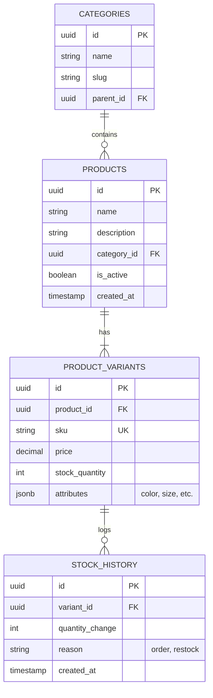
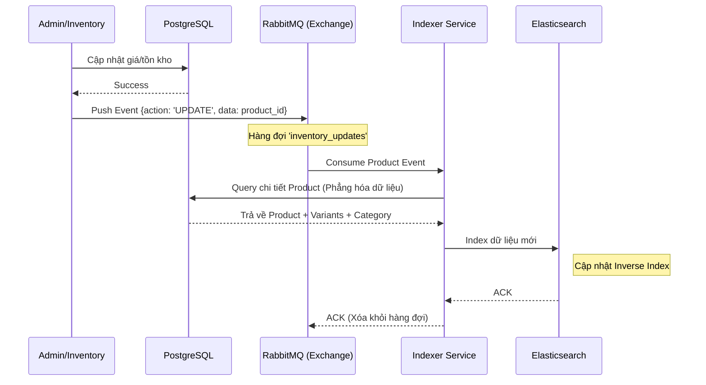

# Bản Kế hoạch Thiết kế Chi tiết: Hệ thống Tìm kiếm Thương mại Điện tử Quy mô lớn

Tài liệu này trình bày thiết kế chi tiết cho một hệ thống tìm kiếm sản phẩm có khả năng mở rộng cao (High scalability), đảm bảo tính nhất quán của dữ liệu (Consistency) và hiệu năng tối ưu (Performance) cho người dùng cuối.

---

## 1. Thiết kế Cơ sở dữ liệu (Database Design - ERD)

Mô hình dữ liệu quan hệ (PostgreSQL) đóng vai trò là **Source of Truth (Nguồn dữ liệu gốc)**. Dữ liệu được chuẩn hóa để đảm bảo tính toàn vẹn.

---

## 2. Thiết kế Elasticsearch (Search Engine Mapping)

Elasticsearch không lưu trữ dữ liệu trùng lặp hoàn toàn với DB mà lưu trữ dưới dạng **Denormalized (Phẳng hóa)** để tối ưu hóa tốc độ tìm kiếm.

### Cấu trúc Index (`products`):
| Field Name | Type | Analysis / Notes |
| :--- | :--- | :--- |
| `id` | `keyword` | Document ID từ database. |
| `name` | `text` | Sử dụng `standard` + `icu_analyzer` cho tiếng Việt + `edge_ngram` cho autocomplete. |
| `description` | `text` | Chỉ dùng để tìm kiếm toàn văn. |
| `price` | `scaled_float` | Lưu dưới dạng số nguyên (x100) để tiết kiệm dung lượng. |
| `stock` | `integer` | Trạng thái tồn kho. |
| `category` | `object` | Chứa `name` và `path` (ví dụ: "Điện thoại > iPhone"). |
| `attributes` | `nested` | Lưu động các thuộc tính tùy chọn (màu sắc, RAM, bộ nhớ). |
| `suggest` | `completion` | Dành riêng cho tính năng gợi ý từ khóa (Suggestion) khi người dùng đang gõ. |

**Chiến lược Analyzer:** 
Sử dụng `icu_analyzer` hoặc bộ lọc tiếng Việt để xử lý dấu và tách từ chính xác (Tokenization).

---

## 3. Luồng dữ liệu và Đồng bộ hóa (Data Flow & Synchronization)

Hệ thống sử dụng cơ chế **Event-driven Architecture** (Kiến trúc hướng sự kiện) để đồng bộ dữ liệu giữa DB và Elasticsearch thông qua RabbitMQ.

### Sơ đồ Luồng Cập nhật (Write Path):

---

## 4. Thiết kế Hệ thống & Thành phần (Microservices Architecture)

Việc bổ sung **Order Service** là hoàn toàn cần thiết và **không hề trùng lặp** với Indexer Worker. Hai dịch vụ này phục vụ hai mục đích hoàn toàn khác biệt trong hệ sinh thái:

### 4.1. Phân định vai trò (Responsibility Segregation)

| Dịch vụ | Domain (Lĩnh vực) | Nhiệm vụ chính | Giao tiếp |
| :--- | :--- | :--- | :--- |
| **Order Service** | **Business Logic** | Xử lý thanh toán, tạo đơn hàng, quản lý trạng thái, giảm tồn kho trong DB. | Ghi vào PostgreSQL, Phát (Publish) Event vào RabbitMQ. |
| **Indexer Worker** | **Data Sync** | Đảm bảo dữ liệu tìm kiếm luôn mới nhất. | Đọc từ PostgreSQL, Ghi vào Elasticsearch. |
| **Search API** | **Query Logic** | Cung cấp giao diện tìm kiếm cho người dùng cuối. | Đọc từ Elasticsearch, Đọc/Ghi Cache từ Redis. |

### 4.2. Chi tiết các Microservice

#### A. Order Service (Dịch vụ Nghiệp vụ)
*   **Nhiệm vụ:** Là "trái tim" của các giao dịch mua bán.
*   **Cơ chế Stock Reservation:** Sử dụng Redis để giữ hàng (Reserve) cực nhanh trong 10-15 phút khi người dùng nhấn "Mua". Điều này ngăn chặn tình trạng "Overselling" (bán quá số lượng) ở tầng ứng dụng trước khi ghi vào Database.
*   **Output:** Sau khi thanh toán thành công, nó cập nhật PostgreSQL và đẩy message `order.completed` hoặc `inventory.changed` vào RabbitMQ.

#### B. Indexer Worker (Dịch vụ Đồng bộ Infrastructure)
*   **Nhiệm vụ:** Là "cầu nối" đưa dữ liệu từ DB sang Search Engine.
*   **Chiến lược xử lý lô (Bulk Indexing):** Thay vì index từng sản phẩm một cách rời rạc, Worker sẽ tích lũy một lượng message (ví dụ: 100 updates) hoặc chờ trong 2-3 giây để đẩy 1 lần vào Elasticsearch bằng **Bulk API**. Điều này giúp giảm tải cực lớn cho IO của Elasticsearch.
*   **Khả năng chịu lỗi:** Tích hợp cơ chế **Dead Letter Queue (DLQ)** để xử lý lại các bản ghi bị lỗi Mapping.

#### C. Search API (Dịch vụ Truy vấn)
*   **Nhiệm vụ:** Phục vụ người dùng tìm kiếm sản phẩm.
*   **Tối ưu Cache:** 
    *   **Query Cache:** Lưu kết quả của các từ khóa hot ("iPhone", "Laptop") vào Redis.
    *   **Tỉ lệ Cache Hit:** Mục tiêu đạt trên 80% để giảm tải hoàn toàn cho Elasticsearch cụm Master.

### 4.2. Quản lý Hạ tầng (Infrastructure)
*   **Nginx (Load Balancer):** Đóng vai trò Ingress/Gateway. Ưu điểm:
    *   Hỗ trợ SSL/HTTPS tập trung.
    *   Cấu hình **Rate Limiting** để ngăn chặn bot spam tìm kiếm làm sập ES.
    *   Cân bằng tải giữa các bản sao (Replicas) của Search API.
*   **RabbitMQ:** 
    *   Sử dụng cơ chế **Dead Letter Queue (DLQ)**: Khi một message bị lỗi không xử lý được sau 3 lần thử, nó sẽ được đẩy vào DLQ để kỹ thuật viên kiểm tra thủ công.

---

## 5. Chiến lược Mở rộng (Scaling Strategy) - "Expert Tips"

1.  **Elasticsearch Sharding:** Chia nhỏ dữ liệu thành nhiều mảnh (Shards) để tăng khả năng truy xuất đồng thời. Đối với demo này ta dùng 1 shard, nhưng thực tế nên dùng `shards = node_count * 1.5`.
2.  **Circuit Breaker:** Cài đặt bộ ngắt mạch trên Search API. Nếu Elasticsearch gặp sự cố hoặc quá tải, hệ thống sẽ tự động ngắt kết nối và trả về kết quả từ Cache cũ hoặc hiển thị thông báo "Bảo trì" để bảo vệ database.
3.  **Zero-downtime Reindexing (Aliases):** Sử dụng bí danh (Alias) trong Elasticsearch. Khi bạn cần thay đổi cấu trúc Mapping (ví dụ: thêm filter mới), ta tạo Index mới, re-index dữ liệu, sau đó chỉ cần đổi Alias sang Index mới là xong, hệ thống không cần dừng hoạt động (Zero-downtime).
4.  **Monitoring:** Sử dụng Prometheus & Grafana để theo dõi `Indexing Latency` (độ trễ đồng bộ) và `Search Latency` (độ trễ tìm kiếm).

---

## 6. Lộ trình thực hiện & Phân chia công việc (2 Người)

Lộ trình này được thiết kế để **cả hai người đều được trải nghiệm đủ 5 công nghệ**: Elasticsearch, RabbitMQ, Docker, Nginx và Kubernetes thông qua việc đan xen các nhiệm vụ.

### Phase 1: Môi trường lõi & Khung dịch vụ (Infrastructure & Core Services)
*   **Nhiệm vụ chung:** Thống nhất format Event JSON và API spec.
*   **Person A:**
    *   Thiết lập `docker-compose.yml` cho **Postgres** và **Elasticsearch**.
    *   Xây dựng **Search Service** (Node.js) kết nối Elasticsearch (Read).
*   **Person B:**
    *   Thiết lập `docker-compose.yml` cho **RabbitMQ** và **Nginx** (Reverse Proxy).
    *   Xây dựng **Order Service** đơn giản để ghi đơn hàng vào Postgres và bắn tin vào RabbitMQ.

### Phase 2: Chuyên sâu Tìm kiếm & Đồng bộ (Advanced Search & Sync)
*   **Person A:**
    *   Cấu hình **Vietnamese mapping** trong Elasticsearch (xử lý dấu, tách từ).
    *   Viết logic tìm kiếm nâng cao (Fuzzy search, Multi-match).
*   **Person B:**
    *   Xây dựng **Indexer Worker** tiêu thụ message từ RabbitMQ.
    *   Thực hiện **Bulk Indexing** từ Postgres sang Elasticsearch.

### Phase 3: Độ tin cậy & Xử lý lỗi (Resilience & Error Handling)
*   **Person A (Tiếp nhận phần code của B):**
    *   Cài đặt cơ chế **Retry** (3 lần) và **Dead Letter Queue (DLQ)** cho Indexer Worker.
    *   Xử lý các lỗi "Mapping Conflict" khi đẩy dữ liệu vào ES.
*   **Person B (Tiếp nhận phần code của A):**
    *   Cấu hình **Rate Limiting** trên Nginx để bảo vệ Search Service.
    *   Cài đặt logic **Circuit Breaker** (dùng library Opossum) cho Search API khi ES gặp sự cố.

### Phase 4: Triển khai Kubernetes (Kubernetes Deployment)
*   **Person A:**
    *   Viết Manifests (Deployment/Service) cho các thành phần **Stateless** (Search, Order, Indexer).
    *   Cấu hình **Horizontal Pod Autoscaling (HPA)** dựa trên CPU.
*   **Person B:**
    *   Viết Manifests cho các thành phần **Stateful** (Postgres, RabbitMQ, Elastic) sử dụng **PersistentVolume (PV)**.
    *   Cấu hình **Liveness/Readiness Probes** để K8s tự động phục hồi các service khi lỗi.

---

## 7. Các kỹ năng sẽ đạt được sau dự án (Learning Outcomes)

| Công nghệ | Kỹ năng học được |
| :--- | :--- |
| **Elasticsearch** | Thiết kế Index, Mapping tiếng Việt, Bulk API, Aliases. |
| **RabbitMQ** | Fanout/Direct Exchange, Consumer Ack, Retry, DLQ. |
| **Docker** | Dockerfile tối ưu, Docker Compose network & volume. |
| **Kubernetes** | Quản lý Deployment, Service, StatefulSet, PV, HPA. |
| **Nginx** | Reverse Proxy, Load Balance, Ingress Rule, Rate Limit. |
| **Hệ thống** | Tư duy Event-driven và Microservices communication. |
