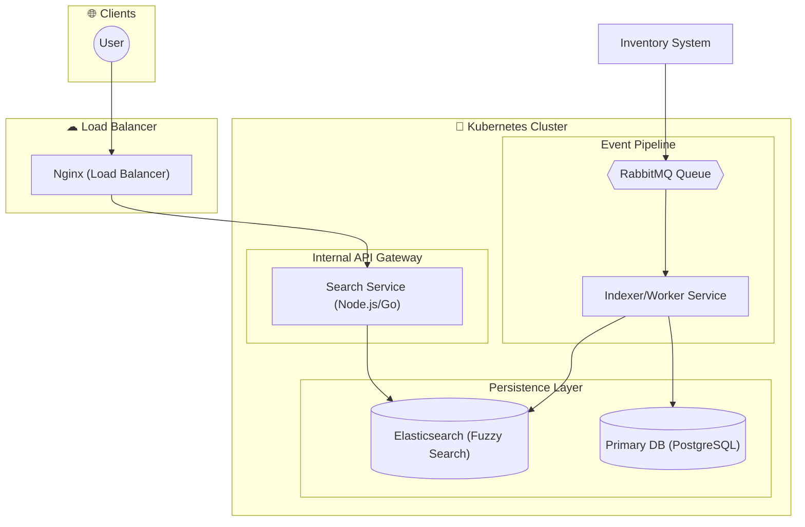
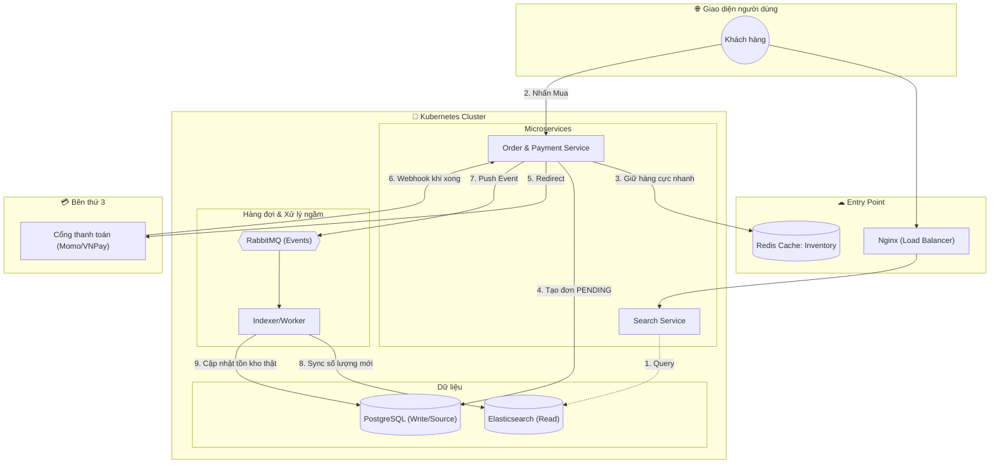

# Kiến trúc và Cách thực hiện Hệ thống Tìm kiếm Thương mại Điện tử Quy mô lớn

## 1. Tổng quan (Overview)
Hệ thống được thiết kế để cung cấp khả năng tìm kiếm sản phẩm thời gian thực cho hàng triệu bản ghi, đảm bảo tốc độ phản hồi cực nhanh (< 100ms) và có khả năng chịu tải tốt trong các sự kiện lưu lượng truy cập cao như Flash Sale.

---

## 2. Kiến trúc Kỹ thuật (System Architecture)

Hệ thống sử dụng mô hình Microservices được triển khai trên Kubernetes (K8s) với các thành phần chính sau:

### Sơ đồ Kiến trúc Tổng thể:

### Các thành phần chi tiết:
*   **Load Balancer (Nginx):** Tiếp nhận yêu cầu từ người dùng và điều hướng đến các service khả dụng.
*   **API Gateway (Node.js/Go):** Xử lý yêu cầu tìm kiếm, xác thực (auth) và giới hạn lưu lượng (rate limit).
*   **Message Queue (RabbitMQ):** Tiếp nhận các sự kiện (events) cập nhật sản phẩm từ hệ thống kho (Inventory).
*   **Search Engine (Elasticsearch):** Lưu trữ index dữ liệu, hỗ trợ tìm kiếm mờ (fuzzy search) và bộ lọc (filter).
*   **Orchestration (Kubernetes):** Quản lý các Pod, tự động mở rộng (auto-scaling).
*   **Infrastructure (Docker):** Đóng gói môi trường và triển khai nhất quán.

---

## 3. Cách thực hiện và Luồng dữ liệu (Implementation & Data Flow)

Hệ thống chia làm hai luồng chính: Luồng đọc (Tìm kiếm) và Luồng ghi (Cập nhật dữ liệu).

### 3.1. Luồng Tìm kiếm (Read Path)
1.  **Request:** Người dùng gửi yêu cầu tìm kiếm qua giao diện.
2.  **Gateway:** Nginx chuyển hướng đến **Search Service**.
3.  **Search:** Search Service thực hiện truy vấn trực tiếp vào **Elasticsearch**.
4.  **Response:** Trả về kết quả tìm kiếm với tốc độ < 100ms.

### 3.2. Luồng Cập nhật & Thanh toán (Write Path)
Dưới đây là quy trình khi người dùng thực hiện mua hàng và cập nhật tồn kho:

**Chi tiết các bước:**
1.  **Truy vấn:** Người dùng tìm kiếm sản phẩm từ Elasticsearch.
2.  **Đặt hàng:** Khi nhấn "Mua", **Order API** sẽ:
    *   Giữ chỗ sản phẩm (Reservation) trong **Redis** để đảm bảo tốc độ cao.
    *   Tạo đơn hàng trạng thái `PENDING` trong **PostgreSQL**.
3.  **Thanh toán:** Hệ thống điều hướng người dùng sang cổng thanh toán (Momo/VNPay).
4.  **Xử lý sau thanh toán:**
    *   Cổng thanh toán gửi Webhook xác nhận.
    *   **Order API** đẩy sự kiện (Event) vào **RabbitMQ**.
    *   **Indexer Service** tiêu thụ event, thực hiện đồng bộ số lượng mới sang **Elasticsearch** và cập nhật trạng thái đơn hàng/tồn kho thật trong **PostgreSQL**.

---

## 4. Các điểm lưu ý khi triển khai (Key Implementation Notes)

*   **Fuzzy Search:** Cấu hình Elasticsearch để xử lý các trường hợp người dùng gõ sai chính tả.
*   **Inventory Reservation:** Sử dụng Redis giúp tránh tình trạng "Over-selling" (bán quá số lượng) trong các đợt Flash Sale nhờ cơ chế atomic increment/decrement.
*   **Eventual Consistency:** Hệ thống chấp nhận việc dữ liệu trong Elasticsearch có thể chậm hơn PostgreSQL một vài mili giây (tính nhất quán sau cùng) để đổi lấy hiệu năng cao.
*   **Auto-scaling:** K8s sẽ tự động tăng số lượng Pod của Search Service và Indexer Service dựa trên CPU/Memory usage.
